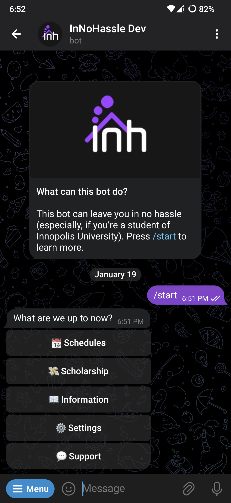

# InNoHassle Telegram Bot



A Telegram bot for the [InNoHassle](https://innohassle.ru/) project. Written in
TypeScript ([Deno](https://deno.com/)) using the [grammY](https://grammy.dev/)
framework.

## Project Guidelines

The code follows the
[Deno Style Guide](https://docs.deno.com/runtime/manual/references/contributing/style_guide).

### Module Organization

The structure of modules is similar to Rust’s new style: a module named
`foo.bar` should have separate `foo/bar.ts` and `foo/bar/...` without
`foo/bar/mod.ts`.

<details>
<summary><b>Illustration</b></summary>

✅ Good:

```text
src/
├── foo/
│   ├── bar/
│   │   └── ...
│   ├── bar.ts
│   └── ...
├── foo.ts
└── ...
```

🚫 Bad:

```text
src/
├── foo/
│   ├── bar/
│   │   ├── mod.ts
│   │   └── ...
│   ├── mod.ts
│   └── ...
└── ...
```

</details>

### Code Structure

- [`deno.jsonc`](deno.jsonc) — the manifest file.
- [`src/`](src/) — all the source code.
- [`locales/`](locales/) — localization files (UI texts).
- [`src/bot.ts`](src/bot.ts) — the entry point.
- [`src/conversations`](src/conversations) — main “building blocks” (sort of
  like plugins).
- [`src/labels`](src/labels) — most string literals are wrapped into enums here
  for the sake of maintainability and IDE suggestions.

## Local Deveolpment

### Dependencies

You need to have `deno` available on your machine. Refer to the
[official guide](https://docs.deno.com/runtime/manual/getting_started/installation)
for additional information.

### Clone the repository

Via HTTPS:

```sh
$ git clone https://github.com/one-zero-eight/InNoHassle-Bot.git
```

Via SSH:

```sh
$ git clone git@github.com:one-zero-eight/InNoHassle-Bot.git
```

### Open the directory

The CLI way:

```sh
$ cd InNoHassle-Bot/
```

Or you can use any file explorer you want instead.

### Configure local parameters

Copy [`.env.example`](.env.example) to `.env`:

```sh
$ cp .env.example .env
```

Open `.env` in your editor of choice and set the `BOT_TOKEN` variable (you can
get the token from [BotFather](https://t.me/BotFather)).

### Launch the bot

Launching from scratch:

```sh
$ deno task start
```

Saving user data:

```sh
$ deno task run
```

All the dependencies will be installed automatically.
